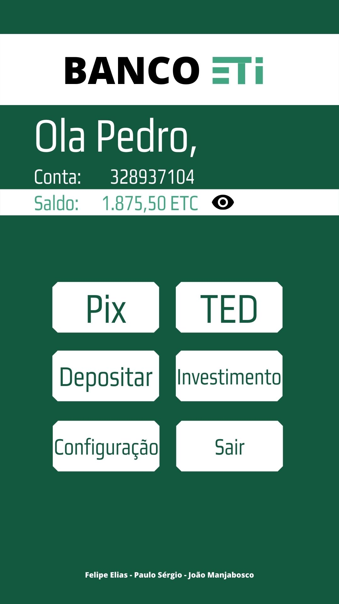
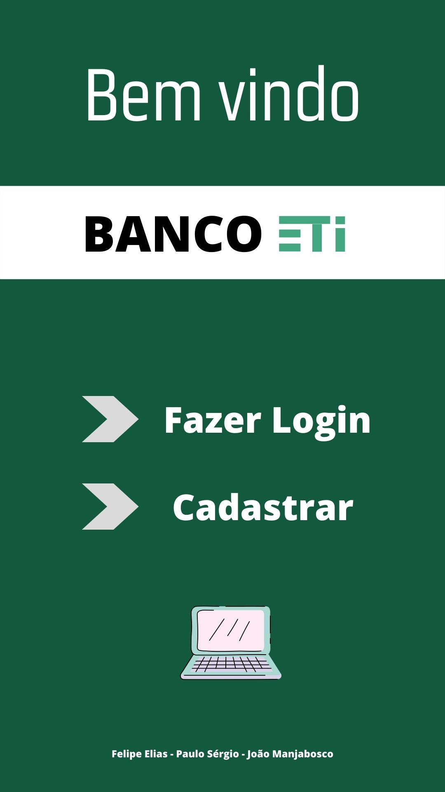

## Banco ETI

br
O trabalho final da matéria de Introdução a programação, curso Sistema de Informação é um sistema bancário que tem a opção de acrescentar cada cliente, fazer um pix, depositar dinheiro, e fazer um investimento e algumas outras funcionalidades. Nós a biblioteca pthread, e manipulação de arquivo .txt .

A moeda utilizada é o Eticoin, com símbolo ETC.

Alunos: 
* [Felipe Elias](https://github.com/FelipeElias021)
* [Paulo Sergio](https://github.com/Paulooooj)
* [João Henrique Manjabosco](https://github.com/Manjabosco98)

us
The final work of Introduction to programming, Information Systems course, it's a banking system developed in C, and has many options, like login, pix (brasilian tranfering), ted, deposit money, make a investiment e another functionalities. We use the pthread library, and files .txt manipulation.

The cryptocurrency is Eticoin, with the ETC symbol

   
## Arte conceitual/ Conceptual art

  
  

